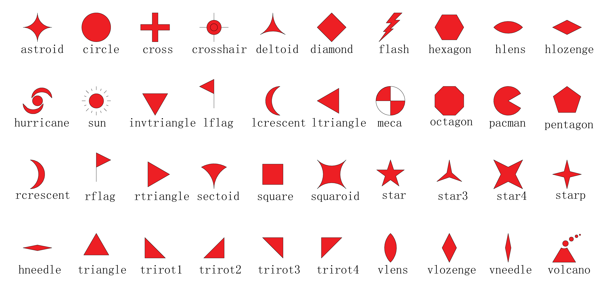

.. _custom_symbols_id:

绘制自定义符号
----------------

GMT 官方目前内置了 40 个自定义符号，如下所示：

对于 GMT 用户来说，这些自定义符号可能仍然无法满足需求。 
因此，社区维护了一套 `GMT自定义符号 <https://github.com/gmt-china/GMT_custom_symbols>`__\ ，
会持续更新一些常用的但还没有被 GMT 官方内置的自定义符号。

GMT 在使用自定义符号时会按照顺序在如下目录中依次搜索自定义符号：

#. 当前目录，即运行脚本所在目录
#. :file:`~/.gmt/custom` 目录（Linux 和 macOS 用户）或 :file:`C:\\Users\\你的当前用户名\\.gmt\\custom` 目录（Windows用户）
#.  :file:`$GMT_SHAREDIR/custom` 目录

用户可以下载社区提供的自定义符号，并复制到以上任一路径，即可使用这些自定义符号。
建议放在 :file:`~/.gmt/custom` 目录（Linux 和 macOS 用户）或
:file:`C:\\Users\\你的当前用户名\\.gmt\\custom` 目录（Windows 用户）下。

绘制自定义符号示例脚本如下：

.. gmtplot::
    :width: 80%
    
    #!/bin/bash
    gmt begin custom_symbol png,pdf

    # 绘制指北针符号，第三列为旋转角度
    echo 3 8 0| gmt plot -Skcompass/0.4i -W0.6p -R0/10/0/10 -JM4i -B2 
    echo 5 8 45| gmt plot -Skcompass/0.5i -Gblue
    echo 7 8 90| gmt plot -Skcompass/0.6i -Gred -W1p
    # 绘制城市符号
    echo 3 5 | gmt plot -Skcity/0.2i -W0.6p
    echo 5 5 | gmt plot -Skcity/0.3i -Gblue
    echo 7 5 | gmt plot -Skcity/0.4i -Gred -W1p
    # 绘制三角形和五角星符号
    echo 2 2 | gmt plot -Sa0.5i -Wblack -Gred
    echo 4 2 | gmt plot -St0.5i -Wblack -Ggreen
    # 绘制图例
    gmt legend -F+p1p -DjBR+o0.2c/0.2c << EOF
    S - kcompass 0.12i white 0.5p - compass
    S - kcity 0.12i white 0.5p - city
    S - a 0.12i red 0.5p - capital
    S - t 0.12i green 0.5p - station
    EOF
    gmt end show
