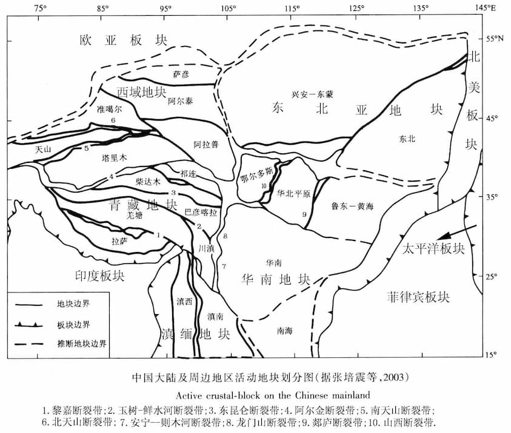

CN-block: 中国大陆及周边活动地块数据
=====================================

中国大陆及周边活动地块分布数据，由下图矢量化而成，并做了一定的格式转换：

    
示例代码如下:

.. gmtplot::
   :show-code: true
   :width: 75%
   
    #!/bin/bash

    gmt begin BLOCK png,pdf
        gmt gmtset MAP_ANNOT_OBLIQUE 6
        gmt gmtset MAP_TICK_LENGTH_PRIMARY 0
        gmt gmtset MAP_FRAME_TYPE plain

        # ============底图
        gmt basemap -R78/12/149/53+r -JB105/10/25/47/15 -Bx10 -By5 -BneWS
        gmt coast -Ggray95 -S83/216/238 -A5000 -Dh
        gmt plot CN-border-L1.gmt -W0.2p -Gwhite

        # ============绘制板块边界。板块边界数据下载地址：https://docs.gmt-china.org/latest/dataset/PB2002/
        gmt plot PB2002_boundaries.dig.txt -W2.0p,2/138/210 -Sf0.5+t+l -G2/138/210
        # ============绘制推断地块边界
        gmt plot CN-block-L1-deduced.gmt -W1.0p,2/138/210,-
        # ============绘制二级地块边界
        gmt plot CN-block-L2.gmt -W1.0p,orange
        # ============绘制一级地块边界
        gmt plot CN-block-L1.gmt -W1.0p,2/138/210

        # ============活动地块标注
        gmt text -F+f10p <<- EOF
        90 45 Xiyu region
        122 46 Northeastern Asia region
        120 35 North China region
        110 27 South China region
        90 33 Tibetan Plateau region
        97 23 Yunnan-Burma region
        EOF

        # ============边界图例
        gmt legend -DjTL+w2.8i+jTL+o0.2c/0.2c -F+gwhite+p0.5p --FONT_ANNOT_PRIMARY=8p <<- EOF
        S 0.3i f0.5+t+l 0.4i/0.3c 2/138/210 2.0p,2/138/210 0.7i Plate boundary
        S 0.3i - 0.50i 2/138/210 1.0p,2/138/210 0.7i Active tectonic-block region boundary
        S 0.3i - 0.44i - 1.0p,2/138/210,- 0.7i  Deduced region boundary
        S 0.3i - 0.50i orange 1.0p,orange 0.7i Active tectonic-block boundary
        EOF

        # ============南海诸岛
        gmt inset begin -DjBR+w2c/2.8c -F+p0.5p
            gmt coast -JM? -R106/121/3/24 -Ggray95 -S83/216/238 -Df
            gmt plot CN-border-La.gmt -W0.2p -Gwhite
        gmt inset end
    gmt end show
    
数据来源及引用
--------------
- 张培震,邓起东,张国民,等. 中国大陆的强震活动与活动地块[J]. 中国科学D辑, 2003, 33(z1):12-20.
- 张国民,马宏生,王辉,等. 中国大陆活动地块边界带与强震活动[J]. 地球物理学报,2005,(03):602-610.
