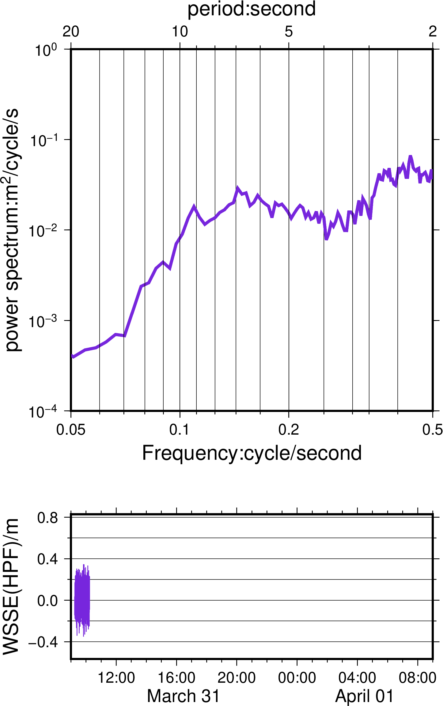

GMT制作GIF动画
====================

:示例贡献者: 杨磊（作者）、刘珠妹（修订）、陈箫翰（修订）
:初次发布: 2021-05-12
:最近更新日期: 2021-05-27
:原文链接: http://assz0a.coding-pages.com/2020/06/07/anni/

----

本示例展示如何使用GMT制作GIF动画。这里以GNSS浮标观测的海面波动为例，
希望展示波浪的时间变化规律。动画设置每一帧显示一个小时的波浪功率谱图像，
不同帧使用不同的颜色表达。示例数据下载 :download:`gnss_b1_hlf_allppk.txt`\ 。

请注意，GMT的动画功能需要另外安装GraphicsMagick组件。由于这个组件是非必须可选安装项目，
建议参阅GMT安装指南的相关章节，确认本机是否已经安装。

制作动画有两种方法，一种是利用Bash脚本语言的for循环，首先先绘制出每一帧的图像，
然后再利用GraphicsMagick合成为GIF动画：

.. literalinclude:: ex028_GraphicsMagick.sh

另一种则是利用GMT的 ``movie`` 模块，语法更为简洁：

.. literalinclude:: ex028_movie.sh

