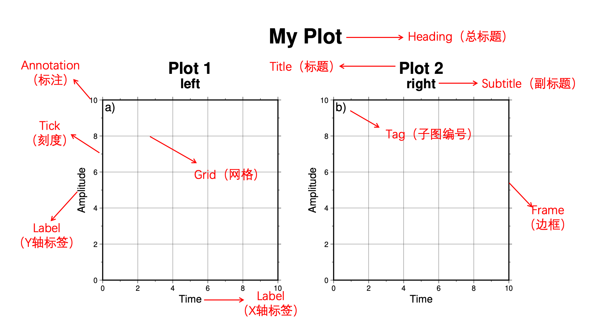

配置参数的设置
================

本节介绍 GMT 的配置参数及其设置方法。GMT 提供了 150 多种配置参数，
用于控制图形的外观和数据的处理方式。这些配置参数一般都有默认值。有时，这些默认值并不合适。
例如，下面这幅图的标题相对于底图大了一些，显得不协调。遇到这样的令人不满意的情况，
就可以自行设置相关配置参数，以细致地调节图形的外观或数据的处理方式。

.. gmtplot::
   :language: bash
   :width: 20%

   gmt basemap -JX2c -R0/1/0/1 -Bwsen+t'Title' -png conf0

要设置配置参数，就需要依次解决两个问题：第一个问题是确定需要修改的配置参数的名称，
第二个问题是如何修改。所以，本节先介绍如何确定配置参数的名称，再介绍配置参数的设置方法。

确定配置参数的名称
---------------------

使用命令 ``gmt defaults`` 可以列出所有配置参数。
配置参数的名称是由它控制的元素的属性决定的，所以知道元素或者属性的名称，就可以尝试进行寻找了。
上面的例子中的问题是标题的字体太大，因此需要修改的配置参数的元素是标题（TITLE)，
而属性是字体（FONT)。下面的命令可以找到和标题（TITLE）有关的参数::

    $ gmt defaults | grep TITLE
    FONT_TITLE                     = 24p,Helvetica,black
    MAP_TITLE_OFFSET               = 14p

下面的命令可以找到和字体（FONT）有关的参数::

    $ gmt defaults | grep FONT
    # FONT Parameters
    FONT_ANNOT_PRIMARY             = 12p,Helvetica,black
    FONT_ANNOT_SECONDARY           = 14p,Helvetica,black
    FONT_HEADING                   = 32p,Helvetica,black
    FONT_LABEL                     = 16p,Helvetica,black
    FONT_LOGO                      = 8p,Helvetica,black
    FONT_TAG                       = 20p,Helvetica,black
    FONT_TITLE                     = 24p,Helvetica,black

最常修改的是底图，所有建议读者记住底图各个元素的确切中英文名称：

配置参数的设置方法
--------------------

配置参数的设置有两种方法：一种为全局设置，对设置以后的所有命令都有效。另一种为临时设置，
只对该条命令有效。下面以配置参数 :term:`FONT_TITLE` 为例，
介绍（全局和临时）设置标题（TITLE）的字体（FONT）的方法。

全局设置需要使用 set 模块。用 set 模块做的设置对之后的所有命令都有效。在下面的例子中，
使用 set 模块全局设置了标题的字体为 ``12p,Times-Bold,red``，
所以后面的两个标题的字体都发生了相应的改变。

.. gmtplot::
   :language: bash
   :width: 50%
   :caption: 标题字体的全局设置

   gmt begin conf1 png
   gmt set FONT_TITLE 12p,Times-Bold,red # 全局设置标题的字体
   gmt subplot begin 1x2 -Fs5c/3c
   gmt subplot set 0
   gmt basemap -JX5c -R0/1/0/1 -Bwsen+t'Title One'
   gmt subplot set 1
   gmt basemap -JX5c -R0/1/0/1 -Bwsen+t'Title Two'
   gmt subplot end
   gmt end

临时设置则是通过为命令添加选项 ``--KEY=value`` 的形式实现的，其中的 KEY 是配置参数的名称，
而 value 是它的值。在下面的例子中，
第一个绘制底图的命令增加了选项 ``--FONT_TITLE=12p,Times-Bold,red``，
所以该底图的标题的字体是红色的。
然而，第二个绘制底图的命令增加的选项是 ``--FONT_TITLE=12p,Times-Bold,blue``，
所以这个底图的标题的字体是蓝色的。

.. gmtplot::
   :language: bash
   :width: 50%
   :caption: 标题字体的临时设置

   gmt begin conf2 png
   gmt subplot begin 1x2 -Fs5c/3c
   gmt subplot set 0
   gmt basemap -JX5c -R0/1/0/1 -Bwsen+t'Title One' --FONT_TITLE=12p,Times-Bold,red
   gmt subplot set 1
   gmt basemap -JX5c -R0/1/0/1 -Bwsen+t'Title Two' --FONT_TITLE=12p,Times-Bold,blue
   gmt subplot end
   gmt end
