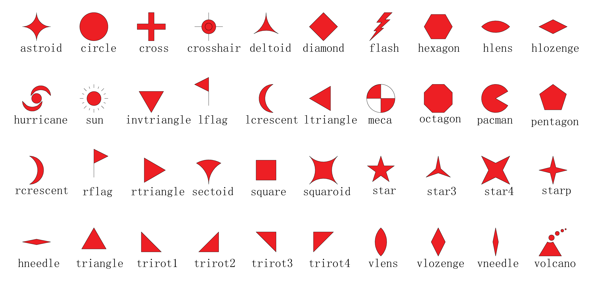

绘制符号
========

绘制各种类型的符号也是常见的绘图需求之一。GMT支持绘制十几种常见的符号类型，
还支持自定义复杂的符号类型，足以满足日常的科研绘图需求。这一节将介绍如何
使用 :doc:`/module/plot` 模块绘制多样的符号。

符号一览
--------

**plot** 模块绘制符号需要使用 **-S** 选项。\ **-S** 选项后面紧跟着符号类型代码，
以及符号大小。GMT中常见的十几种简单符号及其对应的符号类型代码如下图所示。
比如 **c** 代表圆（\ **c**\ ircle），\ **t** 代表三角形（\ **t**\ riangle）。

.. gmtplot:: symbols.sh
    :show-code: false

绘制简单符号
------------

以绘制圆圈为例，通过查询文档或者看上图可知，圆圈对应的符号类型代码为 **c**\ 。
**-Sc0.5c** 则表示绘制直径为0.5厘米的圆圈。
为了绘制圆圈，我们需要给定圆圈的位置，因而输入数据中需要提供圆圈的X和Y坐标。

下面的示例中在(2,3)、(5,6)、(8,2) 三个点绘制了三个直径为0.5厘米的圆圈。

.. gmtplot::
    :width: 60%

    gmt begin symbols png,pdf
    gmt plot -R0/10/0/10 -JX10c/10c -Baf -Sc0.5c << EOF
    2 3
    5 6
    8 2
    EOF
    gmt end show

与绘制线段和多边形类似，我们可以使用 **-W** 选项控制符号轮廓的画笔属性，
使用 **-G** 选项为符号设置填充色。下面的命令就绘制了三个黑边红色圆圈。

.. gmtplot::
    :width: 60%

    gmt begin symbols png,pdf
    gmt plot -R0/10/0/10 -JX10c/10c -Baf -Sc0.5c -W1p,black -Gred << EOF
    2 3
    5 6
    8 2
    EOF
    gmt end show

若想要绘制其它符号，则只需要使用对应的符号类型代码即可。例如，将 **-Sc0.5c**
改成 **-St0.5c** 则会绘制三角形。

当然，某些符号类型可能需要额外的输入数据。比如 **-Sr** 表示绘制长方形，
此时输入数据中除了需要长方形的X和Y坐标之外，还需要长方形的宽和高，因而输入
数据需要四列。对于这些输入数据稍复杂的符号，可以阅读文档以了解其输入数据的格式。

大小变化的符号
--------------

若想要绘制大小变化的符号，则需要在输入数据中额外加上一列以控制每个符号的大小，
同时，在 **-S** 选项中则不再需要指定符号大小。

下面的示例中，\ **-Sc** 中没有指定圆圈大小，此时输入数据的第三列控制圆圈大小。
由此，我们即得到了大小变化的符号。

.. gmtplot::
    :width: 60%

    gmt begin symbols png,pdf
    gmt plot -R0/10/0/10 -JX10c/10c -Baf -Sc -W1p,black -Gred << EOF
    2 3 0.3
    5 6 0.8
    8 2 0.5
    EOF
    gmt end show

颜色变化的符号
--------------

前面提到，使用 **-G** 选项可以为符号填充颜色，但其只能同时为所有符号指定单一的颜色。
如果想要让符号的颜色根据某个数值的不同而使用不同的颜色，则需要使用 **-C** 选项。
**-C** 选项表示符号的填充色由某个数值以及CPT颜色表所控制。CPT颜色表给出了数值与
颜色之间的对应关系。因而对于任意一个符号，我们都可以给其一个数值，GMT会根据该
数值从CPT颜色表中找到对应的颜色作为该符号的填充色。因而，在输入数据中，我们需要在
X和Y坐标的基础上额外加一列Z值，用于控制符号的填充色。

下面的示例中，我们首先使用 **makecpt** 模块，以GMT内置CPT颜色表 **hot** 为基础，
生成了一个新的CPT颜色表。关于CPT颜色表的具体细节在后面会介绍到。此处，读者只需要
知道，我们制作了一个CPT文件供后面的命令使用。该CPT颜色表为0到3之内的每个数值
都对应了一个颜色。

同时，对于输入数据，我们额外增加一列（通常称这一列为Z值），该列的值决定了符号的
填充色。

.. gmtplot::
    :width: 60%

    gmt begin symbols png,pdf
    gmt makecpt -Chot -T0/3/1
    gmt plot -R0/10/0/10 -JX10c/10c -Baf -Sc0.5c -W1p,black -C << EOF
    2   3   0
    5   6   1
    8   2   2
    EOF
    gmt end show

绘制不同的符号
--------------

前面说到，\ **-S** 选项中指定不同的符号类型代码则代表绘制不同的符号，但每次只能
指定一种符号类型代码。如果想要不同的数据使用不同的符号绘制，则可以只指定符号大小
而不指定符号类型代码，并在输入数据的最后一列指定符号类型代码。

下面的示例中，我们使用 **-S0.5c** 指定了符号的大小，但是没有指定符号类型。
输入数据的最后一列中 **c**\ 、\ **t**\ 和 **i** 则分别为三个数据指定了各自的
符号类型。

.. gmtplot::
    :width: 60%

    gmt begin symbols png,pdf
    gmt basemap -R0/10/0/10 -JX10c/10c -Baf
    gmt plot -S0.5c -W1p,black -Gred << EOF
    2 3 c
    5 6 t
    8 2 i
    EOF
    gmt end show

大小、颜色和符号类型都变化的符号
--------------------------------

前面介绍了如何绘制大小变化或颜色变化或符号类型变化的符号。那么如何实现颜色、大小
以及符号三者都变化的符号呢？可以使用 **-S** 但不指定符号类型以及符号大小，同时
使用 **-C** 选项。

关键问题在于，此时的数据数据格式是怎样的。根据GMT的规定，此时输入数据的格式为::

    X   Y   Z   size    symbol

即第三列控制符号填充色，第四列为符号大小，最后一列为符号类型代码。

.. gmtplot::
    :width: 60%

    gmt begin symbols png,pdf
    gmt makecpt -Chot -T0/3/1
    gmt plot -R0/10/0/10 -JX10c/10c -Baf -S -W1p,black -C << EOF
    2   3   0   0.3 c
    5   6   1   0.8 t
    8   2   2   0.5 i
    EOF
    gmt end show

.. _custom_symbols_id:

绘制自定义符号
----------------

GMT 官方目前内置了 40 个自定义符号，如下所示：

但是对于广大用户来说，这些自定义符号仍然远远无法满足需求。 
因此，社区维护了一套 `GMT自定义符号 <https://github.com/gmt-china/GMT_custom_symbols>`__\ ，
会持续更新一些常用的但还没有被 GMT 官方内置的自定义符号。

GMT 在使用自定义符号时会按照顺序在如下目录中依次搜索自定义符号：

#. 当前目录，即运行脚本所在目录
#. :file:`~/.gmt/custom` 目录（Linux 和 macOS 用户）或 :file:`C:\Users\你的当前用户名\.gmt\custom` 目录（Windows用户）
#.  :file:`$GMT_SHAREDIR/custom` 目录

用户可以下载社区提供的自定义符号，并复制到以上任一路径，即可使用这些自定义符号。
建议放在 :file:`~/.gmt/custom` 目录（Linux 和 macOS 用户）或
:file:`C:\Users\你的当前用户名\.gmt\custom` 目录（Windows 用户）下。

绘制自定义符号示例脚本如下：

.. gmtplot::
    :width: 80%
    
    #!/bin/bash
    gmt begin custom_symbol png,pdf

    # 绘制城市符号
    echo 3 5 | gmt plot -R0/10/0/10 -JM4i -B2 -Skcity/0.2i -W0.6p
    echo 5 5 | gmt plot -Skcity/0.3i -Gblue
    echo 7 5 | gmt plot -Skcity/0.4i -Gred -W1p
    # 绘制指北针符号，第三列为旋转角度
    echo 3 8 0| gmt plot -Skcompass/0.4i -W0.6p
    echo 5 8 45| gmt plot -Skcompass/0.5i -Gblue
    echo 7 8 90| gmt plot -Skcompass/0.6i -Gred -W1p
    # 绘制三角形和五角星符号
    echo 2 2 | gmt plot -Sa0.5i -Wblack -Gred
    echo 4 2 | gmt plot -St0.5i -Wblack -Ggreen
    # 绘制图例
    gmt legend -F+p1p -DjBR+w1.2i+o0.2c/0.2c << EOF
    S 0.2c kcompass 0.15i white 0.5p 1c compass
    S 0.2c kcity 0.15i white 0.5p 1c city
    S 0.2c a 0.15i red 0.5p 1c capital
    S 0.2c t 0.15i green 0.5p 1c station
    EOF
    gmt end show
