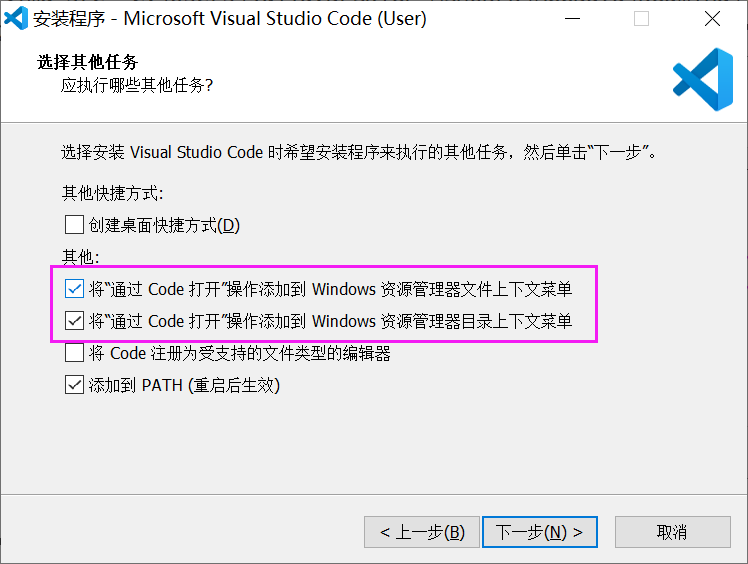
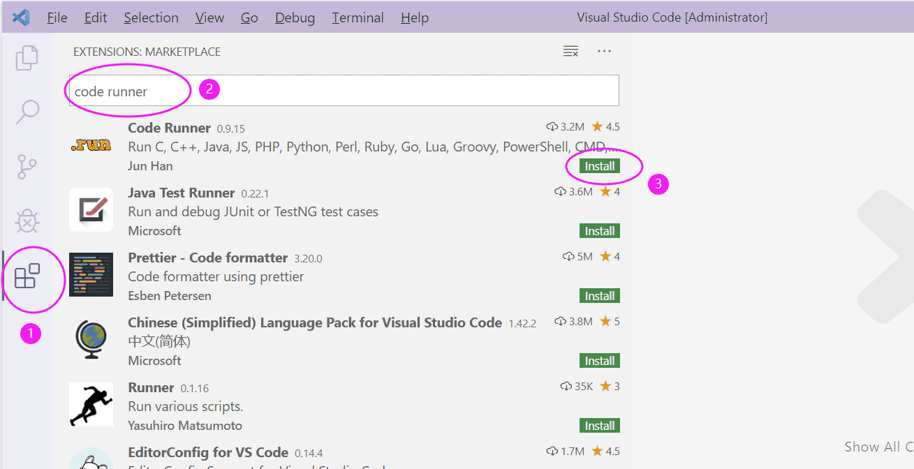
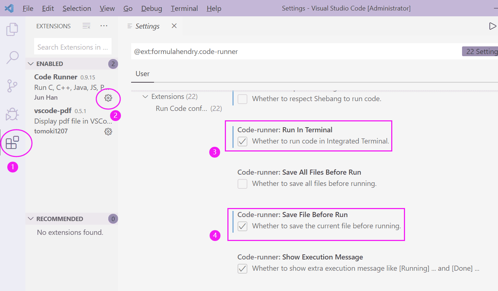
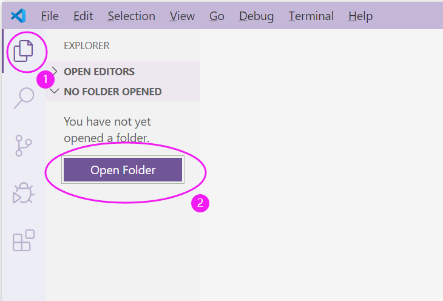
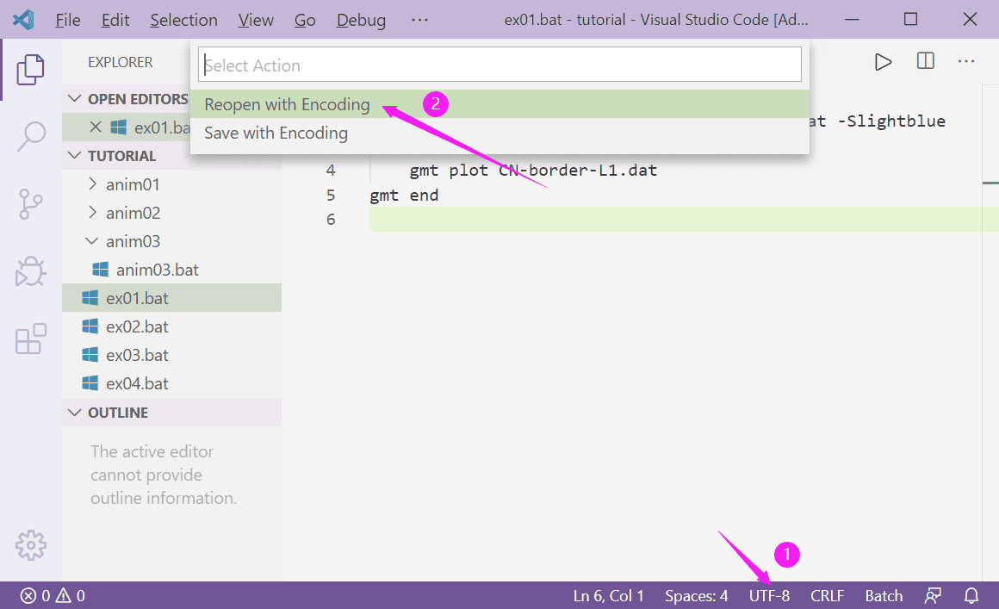
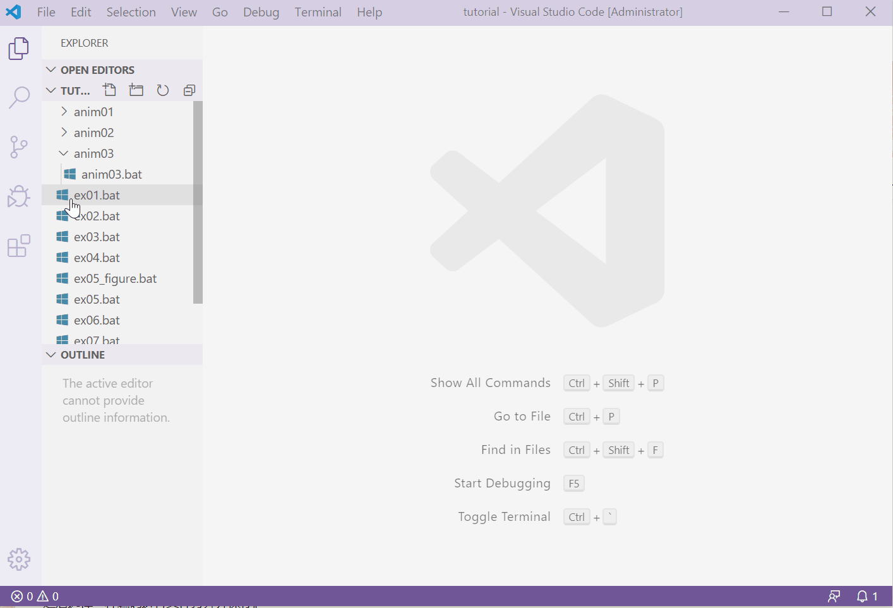
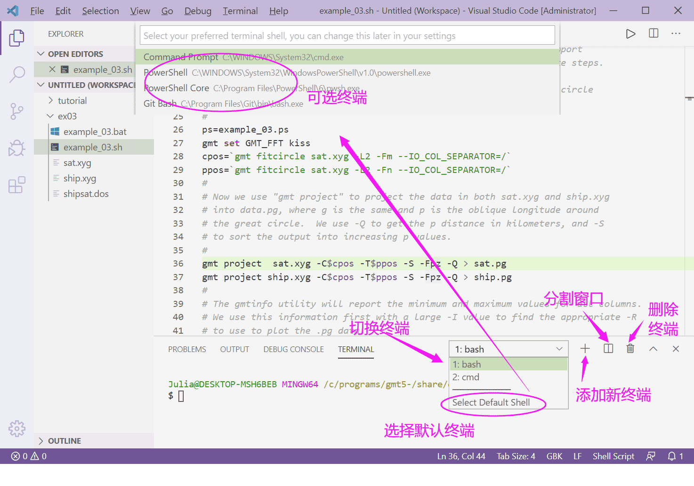

Visual Studio Code
=====================

:贡献者: |刘珠妹|, |赵志远|, |陈箫翰|

----

Visual Studio Code，简称 VS Code ，是微软推出的一款免费、轻量且功能强大的编辑器。
VS Code 除一键执行、语法高亮、分屏显示外，还可实现bat/bash脚本的顺滑切换运行、
jpg/gif/pdf等成图结果实时预览、脚本报错信息显示，非常适合全平台下执行GMT脚本。

VS Code 是跨平台软件，支持linux/Mac/Windows平台。本文以windows为例介绍其使用方法。

VS Code 安装
--------------

VS Code下载地址为： https://code.visualstudio.com/Download

安装中建议勾选下图中两项，目的是添加右键打开的快捷方式。

安装完成之后有两种打开 VS Code的方式：

1. 开始菜单中，直接找到 Visual Studio Code 应用程序打开。
2. 直接在对应脚本或工作文件夹点击右键，选择 ``通过Code打开（Open with Code)`` 。

我们建议使用第二种方法，因为这样在运行 GMT 绘图脚本时，终端的工作目录会自动选定为脚本所在的目录。
使用第一种方法打开绘图脚本后，还需要用户手动切换终端的工作目录，对于初学者来说十分麻烦。

插件安装
--------

为了实现GMT脚本代码的开发运行、图片文件的预览等等一系列功能，必须安装以下插件：

- **Code Runner** ： 支持代码一键运行
- **vscode-pdf** ： pdf预览插件

插件安装方式：打开 **Extensions** 扩展插件菜单，搜索对应插件，点击安装。
安装成功之后， **Install** 图标将变为 **齿轮** ，可点击该齿轮，修改插件属性。
已安装启用的插件都可在 **Extension** 中查看设置。

Code Runner中需要设置终端输出：

在Extensions菜单中，点击Code Runner插件的 **齿轮** 图标，
弹出菜单中选择“ **Extension Settings** ”，勾选“ **Run in Terminal** ”。
另外勾选“ **Save File Before Run** ”，可在执行脚本之前先自动保存。

   
VS code 执行GMT脚本过程
------------------------

在 VS code 中不能直接打开 GMT 脚本文件，而是应该先打开某个文件夹作为工作区。
直接打开 GMT 脚本文件将会造成终端运行工作目录与脚本所在目录不一致，从而导致绘图报错。
可以使用以下两种方式打开某个文件夹作为工作区：

- 在 VS code 中的Explore资源管理器菜单，选择 ``打开文件夹`` ：

- 或者，在文件夹上右键，选择 ``通过Code打开`` ：

含有中文的脚本需要设置编码为 ``GB2312`` ，否则会出现乱码：点击右下角的编码按钮，
再选择“ **重新打开编码（Reopen with Encoding）** ”，选择 ``中文简体GB2312`` 编码。

执行脚本可选择脚本页面右上方三角符号（Alt+F1），脚本运行信息显示在下方Terminal终端窗体。
若想同时预览生成结果，可增加编辑窗口（Split Editor），两个窗口分别显示脚本和运行结果。

若本机安装了Bash终端， VS code 也可识别并自动选择bash终端来执行bash脚本。也可通过手工切换，或多个终端切换执行：

   
.. warning::
    请注意，如果你运行的是 Batch 脚本，请一定要在上图的“切换终端”中选择 cmd，绝对不要使用 PowerShell。
    PowerShell 运行 Batch 绘图脚本会出现无法使用远程数据、中文乱码等错误。
    
    如果你运行的是 bash 脚本，则必须在 ``gmt begin`` 之前添加一行 ``export GMT_SESSION_NAME=$$`` ，否则脚本运行将出现错误。
    详情请参阅 https://docs.gmt-china.org/latest/module/begin/#unix-shell